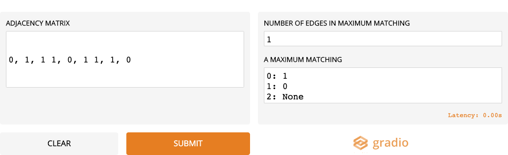

# The MaxMatcher - A web application built using Gradio

We give the code to build a web-app built using Gradio which outputs a maximum matching given an adjacency matrix of an undirected graph


```python
#PIL
from PIL import Image
from pylab import array
import pprint 

#Math and numpy
import math
import numpy as np

#Random
from random import seed
from random import randint
from random import sample

#Matplotlib
import matplotlib.pyplot as plt

#Gradio
import gradio as gr
from io import BytesIO
import base64


from maximum_matching import *

```

# Input out helper functions


```python
def run_blossoms_algorithm_gradio(adjacency_matrix, list_of_vertices=None):
     
     no_of_vertices = len(adjacency_matrix)
     if list_of_vertices is None:
          list_of_vertices = list(range(no_of_vertices))
     
     #Create graph_adjacency_dict
     graph_adjacency_dict =  create_graph_adjacency_dict(adjacency_matrix, list_of_vertices)
     vertices = set(list_of_vertices)

     #Find a maximal matching
     current_matching = find_a_maximal_matching(graph_adjacency_dict,vertices)

     #Find maximum matching
     final_match_dict, no_of_matched_edges = find_max_matching(graph_adjacency_dict, current_matching, vertices)


     return no_of_matched_edges, final_match_dict
    
```


```python
def get_adjacency_matrix(matrix):
    print(matrix)
    matrix_row_strings = matrix.split('\n')
    adj_matrix = []
    for row_string in matrix_row_strings:
        row_string = row_string.replace(" ","")           
        row_string = row_string.split(',')
        row = []
        for element in row_string:
            if element:
                row.append(int(element))
        if row:
            adj_matrix.append(row)
    return adj_matrix

```


```python
def check_validity(adjacency_matrix):
    is_valid = True
    my_msg = ''
    try:
        assert(adjacency_matrix)
        row_lengths = list(map(len, adjacency_matrix))
        row_0_length = len(adjacency_matrix[0])
        assert(row_0_length == len(adjacency_matrix)), "Invalid adjacency matrix : it should be a square matrix"
        assert(all([row_0_length == row_length for row_length in row_lengths])), "Invalid adjacency matrix : it should be a square matrix"
        for i in range(row_0_length):
            assert(adjacency_matrix[i][i] == 0), "Invalid adjacency matrix : no self loops allowed"
            for j in range(i+1,row_0_length):
                assert(adjacency_matrix[i][j]==0 or adjacency_matrix[i][j]==1), "Invalid adjacency matrix : all entries must be 0 or 1"
                assert(adjacency_matrix[i][j] == adjacency_matrix[j][i]), "Invalid adjacency matrix : it should be a symmetric matrix"
                
        
    except AssertionError as msg:
        is_valid = False
        my_msg = str(msg)
        
    
    return is_valid, my_msg
        
        


        
```


```python
def convert_dict_to_string(my_dict):
    my_str_list = []
    for key in my_dict:
        my_str_list.append(f"{key}: {my_dict[key]} \n")
    return ''.join(my_str_list)
    
```


```python
def run_max_matcher(matrix):
    adjacency_matrix = get_adjacency_matrix(matrix)
    print(adjacency_matrix)
    is_valid, my_msg = check_validity(adjacency_matrix)
    if is_valid:
        no_of_matched_edges, final_match_dict = run_blossoms_algorithm_gradio(adjacency_matrix)
        return no_of_matched_edges, convert_dict_to_string(final_match_dict)
    else:
        return my_msg, my_msg
        
    
```

# Gradio interface


```python
gr.Interface(run_max_matcher,
             gr.inputs.Textbox(lines=5, placeholder="Enter the adjacency matrix in the format: Each row in a new line, each matrix entry in the rows separated by commas. Vertices are implicitly assumed to be labelled 0,1,....", 
                               default=None, numeric=False, label= "Adjacency matrix"),
             [gr.outputs.Textbox(label="Number of edges in maximum matching"),
              gr.outputs.Textbox(label="A maximum matching")], 
             title="MaxMatcher", 
             description="Enter the adjacency matrix of any undirected graph. The MaxMatcher will output a maximum matching for it.").launch()  

```

# A screenshot from the web-app




```python

```
